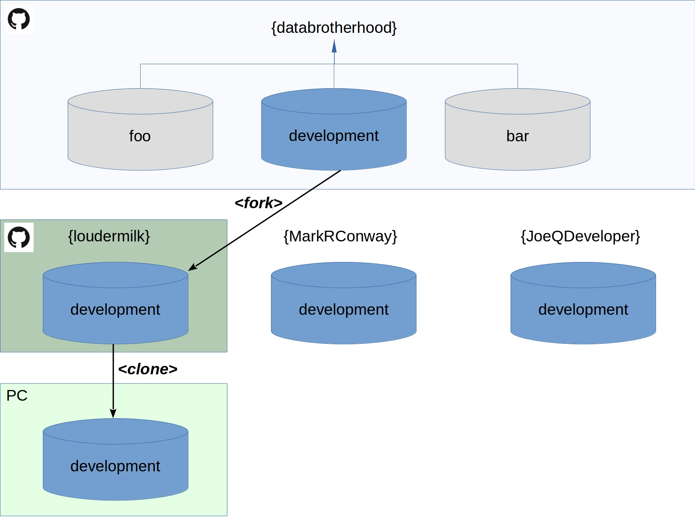

# development 
(**private repository**)

This is the primary development repository for **databrotherhood**. 

FYI - **databrotherhood** is an _individual_, not an _organization_ account at github. This allows us unlimited private repos at 7/month rather than 25/month. We can switch to _organization_ as we scale the company.

**Git Forking Architecture**

## Basic Steps:

 1. Create your personal Github account if you don't already have one.
 
 2. Request to be added as a collaborator on a _specific_ databrotherhood repo (e.g., **development**). 
 
 3. _<fork>_ the target repo to your private account.
 
 4. _<clone>_ your Arepo to your local pc.
 
 5. Make changes in your local.
 
 6. Add changes to your index (git add).
 
 7. Commit changes (git commit).
 
 8. Push changes (git push).
 
 9. Issue a pull request to **databrotherhood**
